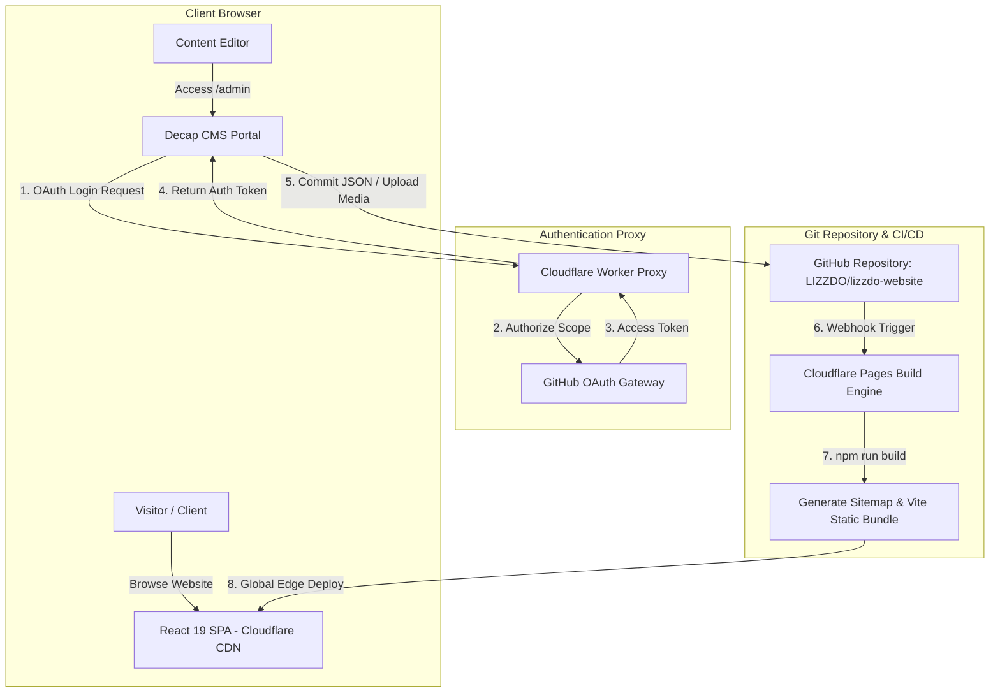
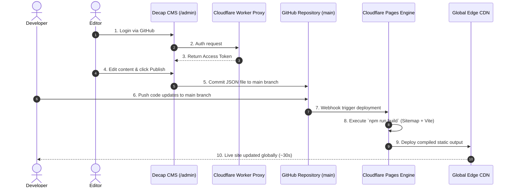

# LIZZDO — Full Developer Guide & Deployment Manual
> **Comprehensive Operational Handbook for the LIZZDO 3D & Digital Experiences Web Platform**


Welcome to the official developer guide and deployment manual for **LIZZDO** — a premier 3D modeling, animation, game development, and digital experiences studio platform.

This manual is engineered to serve as an exhaustive, standalone technical guide. Any developer, administrator, or content editor should be able to clone the repository, understand its inner architecture, configure local environments, deploy to production, manage content via Decap CMS, and execute maintenance operations without requiring external assistance.

---

## 📚 Specialized Documentation Hub

In addition to this primary README handbook, detailed operational guides for each subsystem are located in the [`/docs`](/docs) directory:

| Document File | Topic / Focus Area | Key Contents |
|---|---|---|
| 📄 [`docs/decap-cms.md`](/docs/decap-cms.md) | **Decap CMS Guide** | Architecture, `config.yml` schema, collections, publishing workflows |
| 📄 [`docs/github.md`](/docs/github.md) | **GitHub Repository & OAuth** | Repo settings, branch protection, OAuth App creation, backend rules |
| 📄 [`docs/oauth.md`](/docs/oauth.md) | **OAuth Worker Auth Proxy** | Worker code (`worker.js`), secrets, CORS, Decap postMessage handshake |
| 📄 [`docs/cloudflare.md`](/docs/cloudflare.md) | **Cloudflare Pages & DNS** | Build commands, SPA routing (`_redirects`), edge headers (`_headers`), custom domain |
| 📄 [`docs/deployment.md`](/docs/deployment.md) | **Production Deployment** | Hostinger domain DNS delegation, SSL/TLS Full Strict, CI/CD, rollbacks |
| 📄 [`docs/troubleshooting.md`](/docs/troubleshooting.md) | **Troubleshooting & Security** | OAuth errors, CMS login fixes, build diagnostics, 404 routing, checklist |

---

## 📑 Table of Contents

- [1. Project Overview](#1-project-overview)
  - [1.1 Purpose & Vision](#11-purpose--vision)
  - [1.2 Key Features](#12-key-features)
  - [1.3 Technology Stack](#13-technology-stack)
  - [1.4 System Architecture](#14-system-architecture)
  - [1.5 Build System](#15-build-system)
  - [1.6 Content Management Architecture](#16-content-management-architecture)
  - [1.7 Continuous Deployment Flow](#17-continuous-deployment-flow)
- [2. Project Structure](#2-project-structure)
  - [2.1 File Tree Diagram](#21-file-tree-diagram)
  - [2.2 Core Directories & Files Detailed](#22-core-directories--files-detailed)
- [3. Local Development](#3-local-development)
  - [3.1 Prerequisites & Tooling](#31-prerequisites--tooling)
  - [3.2 Installation & Environment Configuration](#32-installation--environment-configuration)
  - [3.3 Available NPM Scripts](#33-available-npm-scripts)
  - [3.4 Step-by-Step Execution Guide](#34-step-by-step-execution-guide)
- [4. Vite Build Configuration](#4-vite-build-configuration)
  - [4.1 `vite.config.ts` Deep Dive](#41-viteconfigts-deep-dive)
  - [4.2 Asset Processing & Public Directory](#42-asset-processing--public-directory)
  - [4.3 Environment Variables Handling](#43-environment-variables-handling)
  - [4.4 Base URL & Build Output](#44-base-url--build-output)
- [5. React Architecture & Frontend System](#5-react-architecture--frontend-system)
  - [5.1 Routing & Navigation Architecture](#51-routing--navigation-architecture)
  - [5.2 Component Hierarchy & Layout System](#52-component-hierarchy--layout-system)
  - [5.3 Page Views & Route Mapping](#53-page-views--route-mapping)
  - [5.4 Content Glob Loading Engine (`src/lib/content.ts`)](#54-content-glob-loading-engine-srclibcontentts)
  - [5.5 Interactive Three.js 3D Canvas (`ThreeHero.tsx`)](#55-interactive-threejs-3d-canvas-threeherotsx)
  - [5.6 Interactive Project Estimator (`ProjectEstimator.tsx`)](#56-interactive-project-estimator-projectestimatortsx)
- [6. Decap CMS System](#6-decap-cms-system)
  - [6.1 Architecture & Overview](#61-architecture--overview)
  - [6.2 Decap CMS Directory Structure](#62-decap-cms-directory-structure)
  - [6.3 `admin/index.html` Specification](#63-adminindexhtml-specification)
  - [6.4 `admin/config.yml` Configuration](#64-adminconfigyml-configuration)
  - [6.5 Comprehensive CMS Collections Guide](#65-comprehensive-cms-collections-guide)
- [7. Content Management Workflows](#7-content-management-workflows)
  - [7.1 How to Add a Service](#71-how-to-add-a-service)
  - [7.2 How to Add a Portfolio Project](#72-how-to-add-a-portfolio-project)
  - [7.3 How to Add a Store Product](#73-how-to-add-a-store-product)
  - [7.4 How to Add a Blog Post](#74-how-to-add-a-blog-post)
  - [7.5 How to Add a Team Member](#75-how-to-add-a-team-member)
  - [7.6 How to Add a Client & Review](#76-how-to-add-a-client--review)
  - [7.7 How to Add an FAQ Entry](#77-how-to-add-an-faq-entry)
  - [7.8 Editing Static Pages & Global Settings](#78-editing-static-pages--global-settings)
  - [7.9 Logo, Favicon & Brand Asset Updates](#79-logo-favicon--brand-asset-updates)
  - [7.10 Publishing & Git Commits](#710-publishing--git-commits)
- [8. Git & GitHub Repository Strategy](#8-git--github-repository-strategy)
  - [8.1 Repository Setup & Permissions](#81-repository-setup--permissions)
  - [8.2 Branching Strategy](#82-branching-strategy)
  - [8.3 Standard Git Workflow Commands](#83-standard-git-workflow-commands)
- [9. Cloudflare Pages Deployment](#9-cloudflare-pages-deployment)
  - [9.1 Initial Cloudflare Pages Linking](#91-initial-cloudflare-pages-linking)
  - [9.2 Build Command & Directory Settings](#92-build-command--directory-settings)
  - [9.3 SPA Routing & Fallback (`_redirects`)](#93-spa-routing--fallback-_redirects)
  - [9.4 Headers & Cache Policies (`_headers`)](#94-headers--cache-policies-_headers)
  - [9.5 Environment Variables in Cloudflare](#95-environment-variables-in-cloudflare)
  - [9.6 Deployment & Rollback Mechanisms](#96-deployment--rollback-mechanisms)
- [10. Hostinger Custom Domain Setup](#10-hostinger-custom-domain-setup)
  - [10.1 Pointing Hostinger Nameservers to Cloudflare](#101-pointing-hostinger-nameservers-to-cloudflare)
  - [10.2 DNS Record Configuration](#102-dns-record-configuration)
  - [10.3 SSL/TLS Certificate Setup](#103-ssl-tls-certificate-setup)
  - [10.4 HTTPS Enforcement & Verification](#104-https-enforcement--verification)
- [11. GitHub OAuth Integration](#11-github-oauth-integration)
  - [11.1 Purpose of GitHub OAuth](#111-purpose-of-github-oauth)
  - [11.2 Creating the GitHub OAuth App](#112-creating-the-github-oauth-app)
  - [11.3 Callback URL & Configuration Values](#113-callback-url--configuration-values)
- [12. Cloudflare Worker OAuth Proxy](#12-cloudflare-worker-oauth-proxy)
  - [12.1 Purpose & Security Model](#121-purpose--security-model)
  - [12.2 Worker Code (`worker.js`)](#122-worker-code-workerjs)
  - [12.3 Deploying the Worker via Cloudflare Dashboard](#123-deploying-the-worker-via-cloudflare-dashboard)
  - [12.4 Binding Environment Variables](#124-binding-environment-variables)
  - [12.5 Linking Worker to Decap CMS](#125-linking-worker-to-decap-cms)
- [13. Media Asset Management](#13-media-asset-management)
  - [13.1 Folder Structure (`/public/uploads`)](#131-folder-structure-publicuploads)
  - [13.2 Image Formats, Compression & Dimensions](#132-image-formats-compression--dimensions)
  - [13.3 Video Integration (Direct MP4 vs Video Embeds)](#133-video-integration-direct-mp4-vs-video-embeds)
  - [13.4 Document & Downloadable Asset Guidelines](#134-document--downloadable-asset-guidelines)
- [14. Complete Deployment Workflow](#14-complete-deployment-workflow)
  - [14.1 Continuous Delivery Pipeline Diagram](#141-continuous-delivery-pipeline-diagram)
  - [14.2 Code Commit Flow](#142-code-commit-flow)
  - [14.3 Decap CMS Content Publish Flow](#143-decap-cms-content-publish-flow)
- [15. Search Engine Optimization (SEO)](#15-search-engine-optimization-seo)
  - [15.1 Dynamic Head Management (`DocumentHead.tsx`)](#151-dynamic-head-management-documentheadtsx)
  - [15.2 Open Graph & Twitter Cards](#152-open-graph--twitter-cards)
  - [15.3 Automated Sitemap Generator (`generate-sitemap.cjs`)](#153-automated-sitemap-generator-generate-sitemapcjs)
  - [15.4 `robots.txt` & Search Crawlers](#154-robotstxt--search-crawlers)
  - [15.5 Structured Data (JSON-LD)](#155-structured-data-json-ld)
- [16. Security & Access Control](#16-security--access-control)
  - [16.1 Private Repository Protection](#161-private-repository-protection)
  - [16.2 Environment Variable Secrets Management](#162-environment-variable-secrets-management)
  - [16.3 Cloudflare Security Headers & WAF](#163-cloudflare-security-headers--waf)
  - [16.4 Decap CMS Permission Management](#164-decap-cms-permission-management)
- [17. Backup, Recovery & Disaster Management](#17-backup-recovery--disaster-management)
  - [17.1 Git as Single Source of Truth](#171-git-as-single-source-of-truth)
  - [17.2 Instant Rollbacks on Cloudflare Pages](#172-instant-rollbacks-on-cloudflare-pages)
  - [17.3 Disaster Recovery Step-by-Step](#173-disaster-recovery-step-by-step)
- [18. Troubleshooting Guide](#18-troubleshooting-guide)
  - [18.1 Decap CMS & OAuth Login Issues](#181-decap-cms--oauth-login-issues)
  - [18.2 Cloudflare Build Failures](#182-cloudflare-build-failures)
  - [18.3 Client-Side SPA 404 Routing Errors](#183-client-side-spa-404-routing-errors)
  - [18.4 Missing Images or Broken Upload Paths](#184-missing-images-or-broken-upload-paths)
  - [18.5 Three.js 3D Canvas Rendering Issues](#185-threejs-3d-canvas-rendering-issues)
  - [18.6 TypeScript & Linter Verification Failures](#186-typescript--linter-verification-failures)
- [19. System Maintenance & Upgrades](#19-system-maintenance--upgrades)
  - [19.1 Dependency Health Checks](#191-dependency-health-checks)
  - [19.2 Updating Core Frameworks (React, Vite, Tailwind)](#192-updating-core-frameworks-react-vite-tailwind)
  - [19.3 Decap CMS CDN Maintenance](#193-decap-cms-cdn-maintenance)
- [20. Best Practices Summary](#20-best-practices-summary)
  - [20.1 Developer Guidelines](#201-developer-guidelines)
  - [20.2 Content Editor Guidelines](#202-content-editor-guidelines)
  - [20.3 Deployment & Ops Checklist](#203-deployment--ops-checklist)

---

## 1. Project Overview

### 1.1 Purpose & Vision
**LIZZDO** is a high-performance web application representing a digital design and development studio specializing in **3D Modeling, Character Rigging, Roblox Development, Unity/Unreal Engine Experiences, Animation/VFX, and AI Integrations**.

The web platform is designed to provide:
1. An immersive, cyberpunk-inspired visual atmosphere with real-time 3D particle graphics, glowing neon accents, holographic typography, and scanline animations.
2. A client-facing showcase featuring a filterable portfolio, client reviews, in-depth service breakdowns, a knowledge base, and an interactive digital asset store.
3. An **Interactive Project Estimator** allowing potential clients to calculate real-time cost and timeline estimates based on customized project parameters.
4. A git-backed, headless Content Management System (**Decap CMS**) enabling non-technical content managers to edit all site copy, publish blog posts, add portfolio projects, list store products, and manage team profiles without direct code modification.

### 1.2 Key Features
- **3D Real-Time Hero Canvas**: WebGL particle wave canvas built with Three.js (`ThreeHero.tsx`).
- **Cyberpunk UI System**: Built with Tailwind CSS v4 featuring custom animations (glitch text, scanlines, holographic gradients, matrix grids).
- **Interactive Project Estimator**: Dynamic pricing and timeline calculator (`ProjectEstimator.tsx`) embedded on the Contact page.
- **Filterable Portfolio & Lightbox**: Dynamic category filtering, detailed project breakdown views, and a high-resolution media lightbox (`Lightbox.tsx`).
- **Digital Asset Store**: E-commerce store layout (`Store.tsx`, `Product.tsx`, `Checkout.tsx`) for purchasing 3D rigs, lighting presets, and model packs.
- **CMS Content Management**: Complete Decap CMS portal at `/admin/` backed by a custom GitHub OAuth Worker.
- **Automated Dynamic Sitemap**: Node.js script (`generate-sitemap.cjs`) that reads JSON content collections during `npm run build` to generate `/public/sitemap.xml`.
- **Dynamic SEO Head**: `react-helmet-async` wrapper (`DocumentHead.tsx`) applying canonical URLs, meta descriptions, Open Graph cards, and Twitter cards per route.

### 1.3 Technology Stack

```
┌────────────────────────────────────────────────────────────────────────┐
│                          LIZZDO TECH STACK                             │
├──────────────────────┬─────────────────────────────────────────────────┤
│ Frontend Framework   │ React 19 (`react`, `react-dom`)                 │
│ Language             │ TypeScript (`~5.8.2`)                           │
│ Build Tool           │ Vite 6 (`vite`, `@vitejs/plugin-react`)         │
│ Styling              │ Tailwind CSS v4 (`@tailwindcss/vite`)           │
│ Routing              │ React Router v7 (`react-router-dom`)            │
│ Motion & Animation   │ Motion (`motion` / Framer Motion v12)           │
│ 3D Engine            │ Three.js (`three`, `@types/three`)              │
│ Icons                │ Lucide React & Simple Icons (@icons-pack)       │
│ Content Management   │ Decap CMS (`decap-cms` v3 via CDN)              │
│ Head Metadata        │ React Helmet Async (`react-helmet-async`)       │
│ Markdown Renderer    │ React Markdown (`react-markdown`)               │
│ Hosting / CDN        │ Cloudflare Pages                                │
│ Domain Registrar     │ Hostinger (`lizzdo.com`)                        │
│ Auth Proxy           │ Cloudflare Worker (GitHub OAuth)                │
└──────────────────────┴─────────────────────────────────────────────────┘
```

### 1.4 System Architecture



### 1.5 Build System
The application uses Vite 6 for development and compilation.
- **Sitemap Generation Hook**: Prior to bundling, `generate-sitemap.cjs` executes via Node.js to scan `/src/content/` JSON entries and write a compliant `public/sitemap.xml`.
- **Static Asset Compilation**: Vite compiles TypeScript and JSX files into minified ES modules inside `/dist`.
- **SPA Fallback Creation**: The build command executes `cp dist/index.html dist/404.html` so that direct route hits on Cloudflare Pages serve `index.html` without 404 errors.

### 1.6 Content Management Architecture
All site content is stored locally in the repository as **JSON** and **Markdown** files inside `/src/content/`.
Decap CMS provides a visual UI at `/admin/`. When an editor publishes changes in Decap CMS:
1. Decap CMS uses the GitHub API to commit updated JSON files directly into the `main` branch of `LIZZDO/lizzdo-website`.
2. Cloudflare Pages detects the git commit and triggers an automatic build.
3. The live site updates globally within 30–45 seconds.

### 1.7 Continuous Deployment Flow
```text
Developer Push OR Decap CMS Commit ──► GitHub main branch ──► Cloudflare Pages Webhook ──► npm run build ──► Live Site Update
```

---

## 2. Project Structure

### 2.1 File Tree Diagram

```text
/
├── .env.example                  # Environment variable reference template
├── .gitignore                    # Git exclusion rules
├── README.md                     # Official developer guide & deployment manual
├── metadata.json                 # Application name and frame permissions
├── package.json                  # Dependencies, devDependencies, and scripts
├── tsconfig.json                 # TypeScript compiler configuration
├── vite.config.ts                # Vite 6 build configuration
├── generate-sitemap.cjs          # Automated sitemap XML generator
├── index.html                    # HTML template entry point
│
├── public/                       # Assets served directly at root
│   ├── _headers                  # Cloudflare edge headers (CORS, CSP, Cache)
│   ├── _redirects                # Cloudflare SPA route fallback rules
│   ├── robots.txt                # Search crawler instructions
│   ├── site.webmanifest          # Progressive Web App manifest
│   ├── favicon.ico               # Favicon asset
│   ├── lizzdo-logo.png           # Studio brand logo asset
│   ├── admin/                    # Decap CMS Portal
│   │   ├── index.html            # Decap CMS HTML script loader
│   │   └── config.yml            # Decap CMS collections & field schemas
│   └── uploads/                  # Decap CMS image & media storage directory
│
└── src/                          # Main React application source code
    ├── main.tsx                  # React DOM root entry point
    ├── App.tsx                   # Main router & Helmet provider wrapper
    ├── index.css                 # Global CSS, Tailwind v4 theme, Cyber animations
    ├── vite-env.d.ts             # Vite environment TypeScript definitions
    │
    ├── components/               # Shared Reusable UI Components
    │   ├── AnimatedRoutes.tsx    # Route transition & page scroll restoration
    │   ├── DocumentHead.tsx      # Dynamic SEO metadata manager
    │   ├── Footer.tsx            # Footer navigation & global branding
    │   ├── IconMapper.tsx        # Dynamic Lucide & Simple-Icon badge generator
    │   ├── Layout.tsx            # Structural grid & scanline background wrapper
    │   ├── Lightbox.tsx          # High-resolution image/video popup viewer
    │   ├── Navbar.tsx            # Top header navigation & mobile drawer
    │   ├── ProjectEstimator.tsx  # Dynamic project scope & cost calculator
    │   ├── TechGrid.tsx          # Technology stack badge grid
    │   └── ThreeHero.tsx         # Real-time Three.js WebGL particle hero
    │
    ├── content/                  # Git-Backed Content Repositories (JSON)
    │   ├── blog/                 # Technical articles & guides (JSON)
    │   ├── clients/              # Client profiles & review ratings (JSON)
    │   ├── faq/                  # Accordion FAQ questions & answers (JSON)
    │   ├── knowledge/            # Documentation & guides (JSON)
    │   ├── pages/                # Single-page copy (home, about, contact, etc.)
    │   ├── portfolio/            # Portfolio showcase projects (JSON)
    │   ├── services/             # Service catalog specifications (JSON)
    │   ├── settings/             # Site global settings (global.json)
    │   ├── store/                # Digital asset product listings (JSON)
    │   └── team/                 # Team member profiles (JSON)
    │
    ├── data/                     # Content Helper Mappers
    │   ├── blogData.ts           # Blog dataset loaders
    │   ├── faqs.ts               # FAQ category mapping helpers
    │   └── knowledge.ts          # Knowledge base mapping helpers
    │
    ├── lib/                      # Helper Utilities
    │   ├── content.ts            # Import glob loaders for Decap CMS collections
    │   └── utils.ts              # Tailwind class merger (`cn` utility)
    │
    └── pages/                    # Page View Components
        ├── About.tsx             # Studio history, mission, and timeline
        ├── Blog.tsx              # Blog list & tag filtering
        ├── BlogPost.tsx          # Single blog post Markdown renderer
        ├── Checkout.tsx          # Digital asset checkout interface
        ├── Clients.tsx           # Client review showcase
        ├── Contact.tsx           # Contact form & project estimator
        ├── FAQ.tsx               # Accordion FAQ search repository
        ├── Home.tsx              # Primary homepage view
        ├── Legal.tsx             # Terms of service & privacy policy
        ├── Portfolio.tsx         # Category-filtered portfolio grid
        ├── Product.tsx           # Digital store asset product page
        ├── Project.tsx           # Portfolio project case study view
        ├── ServiceDetail.tsx     # Single service specification view
        ├── Services.tsx          # Services catalog overview
        └── Store.tsx             # Digital assets store front
```

### 2.2 Core Directories & Files Detailed

#### `public/admin/config.yml`
Defines Decap CMS collections, backend authentication settings, media paths, and individual field schemas. Must strictly mirror the JSON structure required by React components.

#### `src/lib/content.ts`
Uses Vite's `import.meta.glob` feature to load JSON content dynamically:
- `getCollection(glob)`: Converts a glob object of JSON files into an array of typed content items with `slug` attributes.
- `getSingle(glob)`: Retrieves a single JSON content object (e.g., page settings).

#### `generate-sitemap.cjs`
A CommonJS Node.js script that runs before compilation. It scans static routes and reads dynamic JSON files from `/src/content/` (`services`, `portfolio`, `store`, `blog`) to output `/public/sitemap.xml`.

---

## 3. Local Development

### 3.1 Prerequisites & Tooling
Before setting up the local environment, verify that your machine has the following tools installed:

- **Node.js**: `v20.x.x LTS` (Minimum `v18.0.0`)
- **npm**: `v10.x.x`
- **Git**: `v2.30.0+`
- **Code Editor**: VS Code (Recommended)

### 3.2 Installation & Environment Configuration

1. **Clone the repository**:
   ```bash
   git clone https://github.com/LIZZDO/lizzdo-website.git
   cd lizzdo-website
   ```

2. **Install node packages**:
   ```bash
   npm install
   ```

3. **Configure Environment Variables**:
   Copy `.env.example` to create `.env`:
   ```bash
   cp .env.example .env
   ```
   Modify `.env` content as needed:
   ```env
   GEMINI_API_KEY="YOUR_GEMINI_API_KEY_HERE"
   APP_URL="http://localhost:3000"
   ```

### 3.3 Available NPM Scripts

| Script | Command | Detailed Behavior |
|---|---|---|
| `npm run dev` | `vite --port=3000 --host=0.0.0.0` | Starts the local dev server on port 3000 with HMR enabled. |
| `npm run build` | `node generate-sitemap.cjs && vite build && cp dist/index.html dist/404.html` | Generates sitemap, compiles production bundle to `/dist`, and sets up SPA 404 fallback. |
| `npm run preview` | `vite preview` | Serves the production build from `/dist` locally for validation. |
| `npm run lint` | `tsc --noEmit` | Executes the TypeScript compiler in no-emit mode to catch type errors. |
| `npm run clean` | `rm -rf dist` | Purges existing production build outputs. |

### 3.4 Step-by-Step Execution Guide

To start developing:
```bash
# 1. Install packages
npm install

# 2. Check TypeScript types
npm run lint

# 3. Launch local server
npm run dev
```
Open browser at `http://localhost:3000`.

---

## 4. Vite Build Configuration

### 4.1 `vite.config.ts` Deep Dive

```typescript
import tailwindcss from '@tailwindcss/vite';
import react from '@vitejs/plugin-react';
import path from 'path';
import {defineConfig, loadEnv} from 'vite';

export default defineConfig(({mode}) => {
  const env = loadEnv(mode, '.', '');
  return {
    plugins: [react(), tailwindcss()],
    base: '/',
    resolve: {
      alias: {
        '@': path.resolve(__dirname, '.'),
      },
    },
    server: {
      hmr: process.env.DISABLE_HMR !== 'true',
    },
  };
});
```

### 4.2 Asset Processing & Public Directory
Files placed in `/public` are served directly at the root URL without transformation:
- `/public/uploads/` -> Served as `https://lizzdo.com/uploads/...`
- `/public/admin/` -> Served as `https://lizzdo.com/admin/`
- `/public/sitemap.xml` -> Served as `https://lizzdo.com/sitemap.xml`

### 4.3 Environment Variables Handling
- Client-side variables must be prefixed with `VITE_` and accessed via `import.meta.env.VITE_VAR_NAME`.
- Server-side variables (such as `GEMINI_API_KEY`) are accessed via `process.env.GEMINI_API_KEY`.

### 4.4 Base URL & Build Output
The `base` is configured to `'/'`. The build output directory is `/dist`.

---

## 5. React Architecture & Frontend System

### 5.1 Routing & Navigation Architecture
Routing is managed by `react-router-dom` v7. The router wrapper is located in `src/App.tsx`:

```tsx
export default function App() {
  return (
    <HelmetProvider>
      <Router>
        <Layout>
          <AnimatedRoutes />
        </Layout>
      </Router>
    </HelmetProvider>
  );
}
```

`src/components/AnimatedRoutes.tsx` handles route changes, Framer Motion page transition effects, and scroll restoration (`window.scrollTo(0, 0)`).

### 5.2 Component Hierarchy & Layout System

```text
App
 └── HelmetProvider
      └── Router
           └── Layout (Grid Background, Scanlines, Navbar, Footer)
                └── AnimatedRoutes
                     └── Route Page Component (Home, Portfolio, Services, etc.)
```

### 5.3 Page Views & Route Mapping

| Route Pattern | Component File | Description |
|---|---|---|
| `/` | `src/pages/Home.tsx` | Main landing page with 3D hero, services, and project preview |
| `/about` | `src/pages/About.tsx` | Studio vision, company milestones, and team showcase |
| `/services` | `src/pages/Services.tsx` | Full catalog of studio services & process workflow |
| `/services/:slug` | `src/pages/ServiceDetail.tsx` | In-depth breakdown of a single service |
| `/portfolio` | `src/pages/Portfolio.tsx` | Category-filtered portfolio gallery |
| `/portfolio/:slug`| `src/pages/Project.tsx` | Portfolio project case study view |
| `/store` | `src/pages/Store.tsx` | Digital asset marketplace catalog |
| `/store/:slug` | `src/pages/Product.tsx` | Individual store asset details page |
| `/checkout` | `src/pages/Checkout.tsx` | Asset checkout and payment processing form |
| `/blog` | `src/pages/Blog.tsx` | Knowledge base & blog list |
| `/blog/:id` | `src/pages/BlogPost.tsx` | Single article view with Markdown rendering |
| `/clients` | `src/pages/Clients.tsx` | Verified client partnerships & testimonial reviews |
| `/faq` | `src/pages/FAQ.tsx` | Categorized accordion FAQ page |
| `/contact` | `src/pages/Contact.tsx` | Contact details & Interactive Project Estimator |
| `/legal` | `src/pages/Legal.tsx` | Terms of service and privacy policy |

### 5.4 Content Glob Loading Engine (`src/lib/content.ts`)

```typescript
export const getCollection = (collectionGlob: Record<string, any>) => {
  return Object.keys(collectionGlob).map((key) => {
    const file = collectionGlob[key];
    const slug = key.split('/').pop()?.replace('.json', '') || '';
    return {
      slug,
      ...(file.default || file)
    };
  });
};
```

This utility enables components to load JSON content dynamically:
```typescript
const servicesGlob = import.meta.glob('../content/services/*.json', { eager: true });
const services = getCollection(servicesGlob);
```

### 5.5 Interactive Three.js 3D Canvas (`ThreeHero.tsx`)
Rendered in `Home.tsx`, `ThreeHero.tsx` creates a WebGL particle wave animation using Three.js with mouse interactivity, responsive resize listeners (`ResizeObserver`), and automatic frame cleanup on unmount.

### 5.6 Interactive Project Estimator (`ProjectEstimator.tsx`)
Embedded in `Contact.tsx`, this component lets users configure project parameters (Service Type, Asset Quantity, Complexity Level, Rigging/Animation Add-ons, Expedited Delivery). It calculates real-time estimated cost ranges and project durations, allowing clients to submit pre-populated project requests directly.

---

## 6. Decap CMS System

### 6.1 Architecture & Overview
Decap CMS is an open-source git-backed CMS. When editors access `/admin/`, Decap CMS loads directly in the browser, authenticates via GitHub OAuth, and writes updates as standard JSON files directly to the GitHub repository.

### 6.2 Decap CMS Directory Structure
```text
public/admin/
├── index.html     # Loads Decap CMS JS bundle & Netlify Identity widget
└── config.yml     # Complete collection definitions and backend options
```

### 6.3 `admin/index.html` Specification

```html
<!DOCTYPE html>
<html>
  <head>
    <meta charset="utf-8" />
    <meta name="viewport" content="width=device-width, initial-scale=1.0" />
    <title>LIZZDO Content Manager</title>
    <script src="https://identity.netlify.com/v1/netlify-identity-widget.js"></script>
    <script src="https://unpkg.com/decap-cms@^3.0.0/dist/decap-cms.js"></script>
  </head>
  <body>
    <script>
      CMS.init();
    </script>
  </body>
</html>
```

### 6.4 `admin/config.yml` Configuration

```yaml
site_url: https://lizzdo.com
display_url: https://lizzdo.com
backend:
  name: github
  repo: LIZZDO/lizzdo-website
  branch: main
  base_url: https://lizzdo-cms-auth.workers.dev
  auth_endpoint: /auth

media_folder: "public/uploads"
public_folder: "/uploads"

collections:
  # Collection definitions follow
```

### 6.5 Comprehensive CMS Collections Guide

#### 1. Services (`src/content/services`)
- **title**: Service Name (string)
- **slug**: URL Slug (string)
- **icon**: Lucide Icon Name (e.g., `Box`, `Bot`, `Cpu`, `Gamepad2`)
- **shortDescription**: Brief overview string
- **fullDescription**: Extended service description
- **features**: List of feature strings
- **deliverables**: List of deliverable items
- **pricing**: Starting price string (e.g., `$1,500`)
- **timeline**: Estimated completion timeline string
- **technologies**: List of software tags (e.g., `Blender`, `Maya`, `ZBrush`)
- **image**: Service banner image path

#### 2. Portfolio Projects (`src/content/portfolio`)
- **title**: Project Title
- **slug**: Project Slug
- **category**: `3d-modeling` | `roblox-dev` | `unity-unreal` | `animation-vfx` | `ai-integrations`
- **client**: Client Name
- **completionDate**: Date string
- **heroImage**: Main image path
- **gallery**: List of gallery image paths
- **videoUrl**: YouTube/Vimeo embed URL
- **summary**: Executive summary text
- **challenge**: Project challenge description
- **solution**: Solution description
- **results**: Measured outcomes text

#### 3. Store Products (`src/content/store`)
- **title**: Asset Name
- **slug**: Product Slug
- **price**: Regular price number
- **salePrice**: Sale price number
- **type**: Asset category (e.g., `3D Rig`, `Lighting Preset`)
- **software**: Supported software string
- **format**: File format string (e.g., `.FBX`, `.BLEND`, `.RBXM`)
- **image**: Cover image path
- **gallery**: Product screenshot paths
- **downloadUrl**: External purchase / download link

#### 4. Blog Posts (`src/content/blog`)
- **title**: Post Title
- **slug**: Post Slug
- **publishDate**: Date string
- **author**: Author name string
- **category**: Topic category string
- **tags**: List of tag strings
- **readTime**: Reading time string (e.g., `5 min read`)
- **excerpt**: Short preview text
- **image**: Cover image path
- **content**: Full body text formatted in Markdown

#### 5. Clients & Reviews (`src/content/clients`)
- **name**: Client or Studio Name
- **company**: Company/Studio name
- **role**: Client Title
- **avatar**: Profile picture image path
- **rating**: Star rating number (1 to 5)
- **reviewText**: Testimonial quote
- **verified**: Boolean verified status

#### 6. FAQs (`src/content/faq`)
- **question**: Question string
- **answer**: Answer explanation
- **category**: `general` | `3d-modeling` | `roblox-dev` | `unity-dev` | `pricing-process`

#### 7. Global Settings (`src/content/settings/global.json`)
- **siteName**: Studio Name (`LIZZDO`)
- **siteDescription**: Meta description string
- **contactEmail**: Contact email address
- **socialLinks**: Object containing URLs for Twitter/X, Discord, YouTube, ArtStation, GitHub

---

## 7. Content Management Workflows

### 7.1 How to Add a Service
1. Open `https://lizzdo.com/admin/`.
2. Authenticate via GitHub.
3. Select **Services** from the left sidebar -> Click **New Service**.
4. Fill in `Title`, `Slug`, `Icon` (Lucide name), `Pricing`, `Deliverables`, and upload a banner image.
5. Click **Publish**.

### 7.2 How to Add a Portfolio Project
1. Select **Portfolio Projects** -> Click **New Portfolio Project**.
2. Set `Category`, enter `Client Name`, upload `Hero Image` and `Gallery` screenshots.
3. Paste video embed URL if applicable.
4. Click **Publish**.

### 7.3 How to Add a Store Product
1. Select **Store Products** -> Click **New Store Product**.
2. Enter `Price`, `Software Compatibility`, `File Formats`, and upload preview images.
3. Paste external checkout/download link.
4. Click **Publish**.

### 7.4 How to Add a Blog Post
1. Select **Blog Posts** -> Click **New Blog Post**.
2. Fill in `Title`, `Author`, `Publish Date`, and write article text in the Markdown editor.
3. Upload cover image.
4. Click **Publish**.

### 7.5 How to Add a Team Member
1. Select **Team Members** -> Click **New Team Member**.
2. Enter `Name`, `Role`, `Bio`, specialties tags, and upload headshot image.
3. Click **Publish**.

### 7.6 How to Add a Client & Review
1. Select **Clients** -> Click **New Client**.
2. Enter Client Name, Studio, Star Rating (1-5), and quote text.
3. Click **Publish**.

### 7.7 How to Add an FAQ Entry
1. Select **FAQs** -> Click **New FAQ**.
2. Select Category dropdown, type Question and Answer.
3. Click **Publish**.

### 7.8 Editing Static Pages & Global Settings
1. Select **Pages** -> Select page file (e.g., `Home Page` or `About Page`).
2. Update copy fields and click **Publish**.

### 7.9 Logo, Favicon & Brand Asset Updates
- Branding assets are stored in `/public/`:
  - Main Logo: `/public/lizzdo-logo.png`
  - Favicon: `/public/favicon.ico`
- To update, replace the respective files in the repository and commit.

### 7.10 Publishing & Git Commits
Every **Publish** action in Decap CMS generates an automated git commit on the `main` branch:
```text
Commit: Content [Services] Updated "roblox-development"
Author: Decap CMS [bot]
```

---

## 8. Git & GitHub Repository Strategy

### 8.1 Repository Setup & Permissions
- Repository Name: `LIZZDO/lizzdo-website`
- Visibility: **Private**
- Grant Write access to authorized studio developers and content editors.

### 8.2 Branching Strategy
```text
  main (Production Branch - Monitored by Cloudflare Pages)
   ▲
   ├── PR: feature/new-3d-viewer
   └── Commit: Decap CMS content publishing
```

### 8.3 Standard Git Workflow Commands
```bash
# Pull latest changes
git pull origin main

# Create feature branch
git checkout -b feature/estimator-update

# Commit changes
git add .
git commit -m "feat: updated estimator pricing algorithms"

# Push to origin and open PR
git push origin feature/estimator-update
```

---

## 9. Cloudflare Pages Deployment

### 9.1 Initial Cloudflare Pages Linking
1. Log into [Cloudflare Dashboard](https://dash.cloudflare.com/).
2. Select **Workers & Pages** -> **Create application** -> **Pages** -> **Connect to Git**.
3. Choose `LIZZDO/lizzdo-website` repository.

### 9.2 Build Command & Directory Settings
- **Framework Preset**: `None`
- **Build Command**: `npm run build`
- **Build Output Directory**: `dist`
- **Node Version Variable**: `NODE_VERSION` = `20.0.0`

### 9.3 SPA Routing & Fallback (`_redirects`)
`/public/_redirects` ensures all clean route requests fallback to `index.html`:
```text
/* /index.html 200
```

### 9.4 Headers & Cache Policies (`_headers`)
`/public/_headers` enforces security and edge caching:
```text
/*
  X-Frame-Options: SAMEORIGIN
  X-Content-Type-Options: nosniff
  Referrer-Policy: strict-origin-when-cross-origin

/assets/*
  Cache-Control: public, max-age=31536000, immutable
```

### 9.5 Environment Variables in Cloudflare
Under **Settings** -> **Environment Variables** on Cloudflare Pages, set:
- `GEMINI_API_KEY`: Secrets key for AI features
- `APP_URL`: `https://lizzdo.com`

### 9.6 Deployment & Rollback Mechanisms
If a deployment fails or contains errors, navigate to **Deployments** in Cloudflare Pages, select a previous successful deployment, click the **three dots menu**, and choose **Rollback to this deployment**.

---

## 10. Hostinger Custom Domain Setup

To route your custom domain `lizzdo.com` purchased on Hostinger to Cloudflare:

### 10.1 Pointing Hostinger Nameservers to Cloudflare
1. Add `lizzdo.com` as a site in Cloudflare.
2. Cloudflare will assign two Nameservers (e.g., `ns1.cloudflare.com`, `ns2.cloudflare.com`).
3. Log into Hostinger hPanel -> **Domains** -> Select `lizzdo.com` -> **DNS / Nameservers**.
4. Click **Change Nameservers** and replace Hostinger nameservers with Cloudflare's assigned nameservers.

### 10.2 DNS Record Configuration
In Cloudflare DNS management for `lizzdo.com`:
- **CNAME**: `@` -> `lizzdo-website.pages.dev` (Proxy status: **Proxied**)
- **CNAME**: `www` -> `lizzdo-website.pages.dev` (Proxy status: **Proxied**)

### 10.3 SSL/TLS Certificate Setup
In Cloudflare Dashboard -> **SSL/TLS**:
- Set SSL/TLS encryption mode to **Full (Strict)**.

### 10.4 HTTPS Enforcement & Verification
In Cloudflare Edge Certificates:
- Enable **Always Use HTTPS**.
- Enable **Automatic HTTPS Rewrites**.

---

## 11. GitHub OAuth Integration

### 11.1 Purpose of GitHub OAuth
Decap CMS requires GitHub OAuth authentication so content editors can securely publish changes to the private repository directly from their browser.

### 11.2 Creating the GitHub OAuth App
1. Go to GitHub -> **Settings** -> **Developer Settings** -> **OAuth Apps** -> **New OAuth App**.
2. Settings:
   - **Application Name**: `LIZZDO CMS Authenticator`
   - **Homepage URL**: `https://lizzdo.com`
   - **Authorization Callback URL**: `https://lizzdo-cms-auth.workers.dev/callback`
3. Click **Register Application**.
4. Save the generated **Client ID** and generate a new **Client Secret**.

### 11.3 Callback URL & Configuration Values
- Callback URL MUST match the Cloudflare Auth Worker URL exactly:
  `https://lizzdo-cms-auth.workers.dev/callback`

---

## 12. Cloudflare Worker OAuth Proxy

### 12.1 Purpose & Security Model
Client-side SPAs cannot safely store GitHub Client Secrets. The Cloudflare Worker acts as a serverless token exchange proxy that receives authorization codes from GitHub and safely returns user access tokens to Decap CMS.

### 12.2 Worker Code (`worker.js`)

```javascript
export default {
  async fetch(request, env) {
    const url = new URL(request.url);

    // Initial auth redirect to GitHub
    if (url.pathname === "/auth") {
      const redirectUrl = `https://github.com/login/oauth/authorize?client_id=${env.GITHUB_CLIENT_ID}&scope=repo,user`;
      return Response.redirect(redirectUrl, 302);
    }

    // Callback handler exchanging code for token
    if (url.pathname === "/callback") {
      const code = url.searchParams.get("code");
      if (!code) return new Response("Missing code", { status: 400 });

      const response = await fetch("https://github.com/login/oauth/access_token", {
        method: "POST",
        headers: {
          "Content-Type": "application/json",
          "Accept": "application/json",
        },
        body: JSON.stringify({
          client_id: env.GITHUB_CLIENT_ID,
          client_secret: env.GITHUB_CLIENT_SECRET,
          code: code,
        }),
      });

      const data = await response.json();
      const token = data.access_token;

      if (!token) return new Response(JSON.stringify(data), { status: 400 });

      // Post token back to Decap CMS window
      const html = `
        <!DOCTYPE html>
        <html>
        <body>
          <script>
            (function() {
              function receiveMessage(e) {
                window.opener.postMessage(
                  'authorization:github:success:${JSON.stringify({ token: token, provider: "github" })}',
                  e.origin
                );
              }
              window.addEventListener("message", receiveMessage, false);
              window.opener.postMessage("authorizing:github", "*");
            })();
          </script>
        </body>
        </html>
      `;

      return new Response(html, {
        headers: { "Content-Type": "text/html;charset=UTF-8" },
      });
    }

    return new Response("LIZZDO CMS Auth Proxy Active", { status: 200 });
  },
};
```

### 12.3 Deploying the Worker via Cloudflare Dashboard
1. Go to Cloudflare Dashboard -> **Workers & Pages** -> **Create Worker**.
2. Name it `lizzdo-cms-auth`.
3. Paste the code above into the Worker editor and click **Save and Deploy**.

### 12.4 Binding Environment Variables
In Worker Settings -> **Variables**:
- `GITHUB_CLIENT_ID`: (Your GitHub OAuth Client ID)
- `GITHUB_CLIENT_SECRET`: (Your GitHub OAuth Client Secret - Set as **Secret**)

### 12.5 Linking Worker to Decap CMS
In `public/admin/config.yml`:
```yaml
backend:
  name: github
  repo: LIZZDO/lizzdo-website
  branch: main
  base_url: https://lizzdo-cms-auth.workers.dev
  auth_endpoint: /auth
```

---

## 13. Media Asset Management

### 13.1 Folder Structure (`/public/uploads`)
All media assets uploaded via Decap CMS are saved in `/public/uploads/`.
In code, they are referenced with leading slash relative paths: `/uploads/image-name.jpg`.

### 13.2 Image Formats, Compression & Dimensions
- **Formats**: WebP or PNG preferred.
- **Hero Banners**: `1920x1080px`, max 350 KB.
- **Thumbnails**: `800x600px`, max 150 KB.
- **Avatars**: `400x400px`, max 80 KB.

### 13.3 Video Integration (Direct MP4 vs Video Embeds)
- **Showcase Videos**: Host on YouTube or Vimeo and paste the embed link into the `videoUrl` CMS field.
- **Background Video Loops**: Use MP4 (H.264), no audio stream, resolution 720p, compressed under 5 MB.

### 13.4 Document & Downloadable Asset Guidelines
Digital product pack previews should be placed in `/public/uploads/` or hosted on external CDN solutions (e.g., AWS S3 / Cloudflare R2) for files exceeding 50 MB.

---

## 14. Complete Deployment Workflow

### 14.1 Continuous Delivery Pipeline Diagram



### 14.2 Code Commit Flow
1. Developer makes changes locally and tests with `npm run dev`.
2. Developer validates TypeScript with `npm run lint`.
3. Developer pushes to `main` branch.
4. Cloudflare Pages builds and deploys automatically.

### 14.3 Decap CMS Content Publish Flow
1. Editor logs into `lizzdo.com/admin/`.
2. Editor makes copy/image updates and clicks **Publish**.
3. Decap CMS commits JSON directly to GitHub `main`.
4. Cloudflare Pages automatically triggers build and updates the live site.

---

## 15. Search Engine Optimization (SEO)

### 15.1 Dynamic Head Management (`DocumentHead.tsx`)
Managed by `react-helmet-async`, `DocumentHead.tsx` dynamically sets title tags, descriptions, canonical URLs, and Open Graph attributes for every route.

### 15.2 Open Graph & Twitter Cards
Every page includes:
- `og:title`, `og:description`, `og:image`, `og:url`
- `twitter:card` (`summary_large_image`), `twitter:title`, `twitter:description`, `twitter:image`

### 15.3 Automated Sitemap Generator (`generate-sitemap.cjs`)
Automatically executed during `npm run build`. Scans static pages and dynamic JSON files in `/src/content/` to write `/public/sitemap.xml`.

### 15.4 `robots.txt` & Search Crawlers
Located at `/public/robots.txt`:
```text
User-agent: *
Allow: /
Disallow: /admin/

Sitemap: https://lizzdo.com/sitemap.xml
```

### 15.5 Structured Data (JSON-LD)
`index.html` includes schema.org `Organization` and `ProfessionalService` metadata to optimize search engine indexing.

---

## 16. Security & Access Control

### 16.1 Private Repository Protection
The GitHub repository `LIZZDO/lizzdo-website` is set to **Private**. Access is granted strictly through GitHub team permissions.

### 16.2 Environment Variable Secrets Management
Sensitive API keys (e.g. `GEMINI_API_KEY`) are managed through Cloudflare Pages Environment Variables and never committed to version control.

### 16.3 Cloudflare Security Headers & WAF
Cloudflare enforces HTTPS, anti-clickjacking headers (`X-Frame-Options: SAMEORIGIN`), and MIME-sniffing protection (`X-Content-Type-Options: nosniff`).

### 16.4 Decap CMS Permission Management
Only users added as collaborators to the GitHub repository can authenticate through the Decap CMS login gate.

---

## 17. Backup, Recovery & Disaster Management

### 17.1 Git as Single Source of Truth
Because all content is stored as JSON/Markdown files inside `/src/content/`, every Git commit forms a complete, time-stamped backup of the platform.

### 17.2 Instant Rollbacks on Cloudflare Pages
To revert a bad deployment:
1. Open Cloudflare Pages -> **Deployments**.
2. Find the last stable build -> Click **Rollback to this deployment**.
3. Site reverts globally within 5 seconds.

### 17.3 Disaster Recovery Step-by-Step
```bash
# To undo the last git commit on main:
git revert HEAD
git push origin main
```

---

## 18. Troubleshooting Guide

| Issue / Symptom | Root Cause | Resolution |
|---|---|---|
| **Decap CMS displays "Failed to authenticate"** | OAuth Callback URL mismatch or incorrect secret in Cloudflare Worker | Verify GitHub OAuth Callback URL matches `https://lizzdo-cms-auth.workers.dev/callback`. Re-check `GITHUB_CLIENT_SECRET` in Worker. |
| **Page refresh on route gives 404 error** | Cloudflare Pages SPA fallback rule missing | Ensure `/public/_redirects` has `/* /index.html 200` and `npm run build` creates `dist/404.html`. |
| **Cloudflare Pages build fails** | Node version incompatibility or TypeScript compiler error | Set `NODE_VERSION` = `20.0.0` in Cloudflare Pages settings. Run `npm run lint` locally to fix TS errors. |
| **Images uploaded in CMS return 404** | Missing leading slash or incorrect path in `config.yml` | Ensure `media_folder: "public/uploads"` and `public_folder: "/uploads"`. |
| **Three.js 3D hero canvas missing or blank** | WebGL context loss or container height zero | Ensure wrapper div has explicit height class (`min-h-[500px]` or `h-screen`). |
| **TypeScript check (`npm run lint`) fails** | Type mismatch in JSON schema or component props | Check terminal error logs and update interface definitions in components. |

---

## 19. System Maintenance & Upgrades

### 19.1 Dependency Health Checks
Run quarterly dependency audits:
```bash
npm outdated
```

### 19.2 Updating Core Frameworks (React, Vite, Tailwind)
```bash
npm update
npm run lint
npm run build
npm run preview
```

### 19.3 Decap CMS CDN Maintenance
Decap CMS is loaded via CDN script in `/public/admin/index.html`:
```html
<script src="https://unpkg.com/decap-cms@^3.0.0/dist/decap-cms.js"></script>
```
Periodically check [Decap CMS releases](https://github.com/decaporg/decap-cms/releases) to ensure compatibility.

---

## 20. Best Practices Summary

### 20.1 Developer Guidelines
- Always run `npm run lint` before committing code.
- Keep components modular and single-purpose.
- Use Tailwind CSS utility classes directly rather than inline styles.

### 20.2 Content Editor Guidelines
- Compress images before uploading via Decap CMS (keep under 300 KB).
- Fill in all SEO fields (Title & Description) when creating blog posts or projects.

### 20.3 Deployment & Ops Checklist
- Confirm `main` branch is clean before deploying.
- Verify `lizzdo.com/sitemap.xml` updates after adding new portfolio or store items.
- Maintain backup access to Cloudflare and GitHub administrator accounts.

---

*© LIZZDO Studio. Built for high performance, modular scalability, and digital craftsmanship.*
