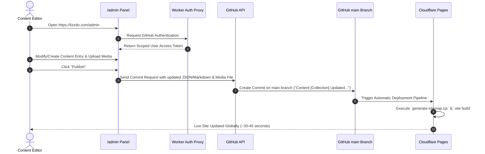

# Decap CMS Configuration & Management Manual — LIZZDO

This document provides a comprehensive operational guide for **Decap CMS** as integrated into the **LIZZDO** web platform.

---

## 1. Overview & Architecture

### What is Decap CMS?
Decap CMS (formerly Netlify CMS) is an open-source, Git-backed Content Management System. Unlike traditional CMS platforms (e.g., WordPress or Drupal) that require database servers (MySQL/PostgreSQL) and dynamic backend execution (PHP/Node), Decap CMS operates purely as a single-page client-side application that interacts directly with your Git repository via GitHub REST APIs.

### Why LIZZDO Uses Decap CMS
- **Git as Single Source of Truth**: All content is version-controlled in the GitHub repository alongside the codebase.
- **Zero Database Overhead**: No database server configuration, maintenance, backup costs, or SQL injection vectors.
- **Automated CI/CD Integration**: Every published change creates a Git commit, automatically triggering Cloudflare Pages to build and deploy static edge assets.
- **Type-Safe Static Collections**: Content is stored in clean `JSON` and `Markdown` files consumed dynamically by Vite using `import.meta.glob`.
- **User-Friendly Editorial Panel**: Non-technical team members can manage portfolio projects, blog posts, store products, services, team members, and testimonials without writing code or operating Git directly.

---

## 2. Decap CMS Architecture & Workflow

### Architectural Diagram

```mermaid
flowchart TD
    subgraph Client Browser
        A[Administrator / Content Editor] -->|1. Navigates to /admin| B[Decap CMS Single Page App]
    end

    subgraph Authentication Engine
        B -->|2. Click Login with GitHub| C[Cloudflare Worker OAuth Proxy]
        C -->|3. OAuth Flow| D[GitHub OAuth App]
        D -->|4. Return Access Token| C
        C -->|5. Post Token Message| B
    end

    subgraph Git Repository
        B -->|6. Edit Content & Click Publish| E[GitHub REST API]
        E -->|7. Direct Commit to main Branch| F[(GitHub Repo: LIZZDO/lizzdo-website)]
    end

    subgraph Build & Edge Deployment
        F -->|8. Webhook Notification| G[Cloudflare Pages Engine]
        G -->|9. Execute npm run build| H[Build Sitemap & Vite Bundle]
        H -->|10. Deploy to Global CDN Edge| I[Live Website Updated (lizzdo.com)]
    end
```

### Decap CMS Content Workflow



---

## 3. File System & File Specifications

Decap CMS requires two primary files in the `/public/admin` directory:

```text
public/admin/
├── index.html     # HTML entry point loading Decap CMS script bundle
└── config.yml     # Complete collection schemas, backend settings, and media paths
```

### 3.1 `public/admin/index.html`

```html
<!DOCTYPE html>
<html lang="en">
  <head>
    <meta charset="utf-8" />
    <meta name="viewport" content="width=device-width, initial-scale=1.0" />
    <title>LIZZDO Content Manager | Decap CMS</title>
  </head>
  <body>
    <!-- Enable manual initialization to prevent double mounting -->
    <script>
      window.CMS_MANUAL_INIT = true;
    </script>
    <!-- Decap CMS Core Library -->
    <script src="https://unpkg.com/decap-cms@^3.0.0/dist/decap-cms.js"></script>
    <!-- Initialize Decap CMS after script load -->
    <script>
      if (window.CMS) {
        window.CMS.init();
      }
    </script>
  </body>
</html>
```

### 3.2 `public/admin/config.yml` Core Options

```yaml
site_url: https://lizzdo.com
display_url: https://lizzdo.com

# Backend configuration linking to GitHub & Cloudflare Auth Worker
backend:
  name: github
  repo: LIZZDO/lizzdo-website
  branch: main
  base_url: https://lizzdo-cms-auth.lets3do.workers.dev
  auth_endpoint: /auth

# Media asset upload configuration
media_folder: "public/uploads"
public_folder: "/uploads"

# Editorial workflow (Drafts, Review, Ready, Publish)
publish_mode: simple
```

---

## 4. Collection Schemas & Data Storage

All content managed via Decap CMS is stored as structured files inside `src/content/`:

| Collection Name | Storage Folder | Format | Primary Identifier |
|---|---|---|---|
| **Services** | `src/content/services/*.json` | JSON | `title` / `slug` |
| **Portfolio** | `src/content/portfolio/*.json` | JSON | `title` / `slug` |
| **Store Products**| `src/content/store/*.json` | JSON | `title` / `slug` |
| **Blog Posts** | `src/content/blog/*.json` | JSON | `title` / `slug` |
| **Clients & Reviews**| `src/content/clients/*.json`| JSON | `name` / `slug` |
| **FAQ Entries** | `src/content/faq/*.json` | JSON | `question` / `slug` |
| **Team Members** | `src/content/team/*.json` | JSON | `name` / `slug` |
| **Pages** | `src/content/pages/*.json` | JSON | Single File File Collections |
| **Global Settings**| `src/content/settings/global.json` | JSON | Single File Collection |

---

## 5. Media Uploads & Asset Management

When an editor uploads an image or asset through Decap CMS:
1. Decap CMS saves the binary file to `public/uploads/filename.png` in the Git commit.
2. In content JSON files, the asset path is saved as `/uploads/filename.png`.
3. In React components, the asset is rendered as ``. Because `/public/uploads` maps directly to root `/uploads` on Vite/Cloudflare, images load instantly across all devices.

---

## 6. How Content Editors Use Decap CMS

### Accessing the Dashboard
1. Navigate to `https://lizzdo.com/admin/`.
2. Click **Login with GitHub**.
3. Authorize the **LIZZDO OAuth App**.
4. The Decap CMS dashboard opens, listing all available collections on the left sidebar.

### Adding & Editing Entries
1. Select a collection from the sidebar (e.g., **Portfolio Projects**).
2. Click **New Portfolio Project** (or click an existing item to edit).
3. Fill out required fields:
   - **Title**: Project display name
   - **Slug**: URL identifier (e.g., `roblox-cyber-arena`)
   - **Featured Image**: Click **Upload** to choose a screenshot
   - **Gallery Images**: Add multiple showcase photos
   - **Project Video URL**: Paste YouTube or Vimeo video links
   - **Full Description**: Markdown body editor
4. Click **Publish** at the top right.
5. Cloudflare Pages automatically triggers a build and deploys the update to `lizzdo.com`.

---

## 7. Decap CMS Setup Status for This Project

- [x] `public/admin/index.html` configured
- [x] `public/admin/config.yml` configured for GitHub backend & collections
- [x] Content directories created in `src/content/`
- [x] JSON import loader implemented in `src/lib/content.ts`
- [x] `_redirects` and SPA routes verified for `/admin/` access
