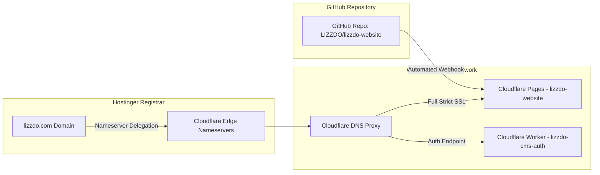
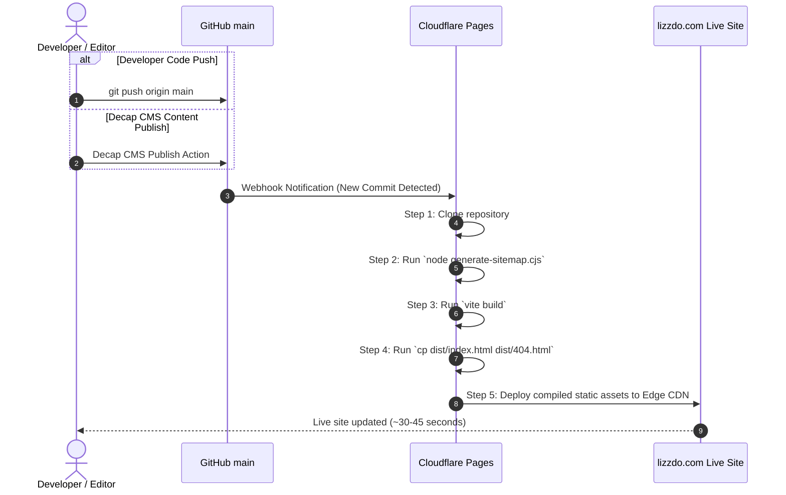

# Complete Production Deployment & Hostinger Domain Guide — LIZZDO

This guide covers the **complete end-to-end deployment process** for LIZZDO, including configuring custom domains registered on **Hostinger**, linking Cloudflare DNS nameservers, configuring SSL certificates, and managing production releases.

---

## 1. Production Architecture Overview



---

## 2. Hostinger Custom Domain Configuration

If your domain `lizzdo.com` was registered on **Hostinger**, follow these exact steps to delegate DNS management to Cloudflare:

### Step 1: Add Site to Cloudflare
1. Log into [Cloudflare Dashboard](https://dash.cloudflare.com/).
2. Click **Add a Site** in the top right.
3. Type `lizzdo.com` and select the **Free Plan** -> Click **Continue**.
4. Cloudflare will scan existing DNS records and present Cloudflare's two assigned authoritative nameservers, for example:
   - `ns1.cloudflare.com`
   - `ns2.cloudflare.com`

### Step 2: Change Nameservers in Hostinger hPanel
1. Open a new tab, log into **Hostinger hPanel** (`https://hpanel.hostinger.com`).
2. Go to **Domains** -> Select `lizzdo.com`.
3. In the left menu, select **DNS / Nameservers**.
4. Click **Change Nameservers** -> Select **Change nameservers manually**.
5. Replace Hostinger's default nameservers (`ns1.dns-parking.com`, `ns2.dns-parking.com`) with Cloudflare's assigned nameservers:
   - **Nameserver 1**: `ns1.cloudflare.com`
   - **Nameserver 2**: `ns2.cloudflare.com`
6. Click **Save**.

> ⏳ **Propagation Time**: DNS nameserver propagation usually completes within 5–15 minutes, but can take up to 24–48 hours in rare cases worldwide.

### Step 3: Verify DNS Delegation in Cloudflare
Return to Cloudflare Dashboard and click **Check nameservers now**. Once verified, status changes to **Active**.

---

## 3. Cloudflare DNS & SSL/TLS Configuration

### Step 1: DNS Records Setup
In Cloudflare DNS (`https://dash.cloudflare.com` -> `lizzdo.com` -> **DNS**):

| Type | Name | Content / Target | Proxy Status | TTL |
|---|---|---|---|---|
| `CNAME` | `@` | `lizzdo-website.pages.dev` | Proxied (Orange) | Auto |
| `CNAME` | `www` | `lizzdo-website.pages.dev` | Proxied (Orange) | Auto |

### Step 2: SSL/TLS Certificate Setup
1. Go to **SSL/TLS** -> **Overview** in Cloudflare.
2. Select **Full (Strict)** encryption mode.
3. Go to **SSL/TLS** -> **Edge Certificates**:
   - Enable **Always Use HTTPS** (Redirects http:// requests to https://).
   - Enable **Automatic HTTPS Rewrites**.
   - Enable **Minimum TLS Version**: `TLS 1.2`.

---

## 4. End-to-End Production Deployment Pipeline

### Continuous Delivery Pipeline Diagram



---

## 5. Rollback & Disaster Recovery Procedures

### 1. Instant Cloudflare Pages Rollback
If a faulty deployment occurs:
1. Open Cloudflare Dashboard -> **Workers & Pages** -> **lizzdo-website** -> **Deployments**.
2. Find the last known healthy deployment.
3. Click the **three dots (...)** menu -> Select **Rollback to this deployment**.
4. The site is restored instantly.

### 2. Git Revision Rollback
To revert the code base permanently in Git:
```bash
# Revert latest commit
git revert HEAD

# Push revert commit to main
git push origin main
```
Cloudflare Pages will automatically build and deploy the reverted commit.
